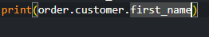

# Instalacion-SQL-Alchemy

Para inciar el curso de Flask-SQLAlchemy, haremos lo mismo que se hace en el curso. Primero abriremos VSCode

Luego crearemos una carpeta y dentro meteremos los siguientes comandos

Ahora toca instalar las dos librerías que nos interesan, lo hacemos de la siguiente forma.

Y creamos un nuevo archivo. En el curso lo llaman App.py, así que para evitar problemas en el futuro lo llamaremos igual

Para poder preparar todo debemos montar lo siguiente

Una vez montado, es hora de crear los modelos. Lo haremos de la siguiente forma

A estos 3 modelos les hemos añadido primary keys que están marcadas por el término primary\_key=True y el resto de valores indicando que no pueden ser valores vacíos. Al poner que  un valor es único, indicamos que estos son únicos y el valor es irrepetible.

Ahora toca relacionar los modelos/tablas de la siguiente manera:

Con esas 3 sentencias relacionamos a las diferentes tablas entre sí

Ahora toca crear la base de datos, empezaremos con el comando flask shell

Importamos la base de datos y la creamos

Y como vemos aparece

Y aquí es donde se supone que salimos para entrar en la base de datos. Problema, al usar dispositivo windows (powershell) este comando da el siguiente error y no he conseguido averiguar la forma de solucionarlo

Teniendo en cuenta que no puedo hacer funcionar la base de datos, seguiremos con el curso para al menos tener la estructura. Así que vamos con lo siguiente

Para ello creamos diferentes funciones que sirvan para diferentes propósitos. Entre ellos: añadir clientes

Con esto creamos 100 clientes falsos para llenar la base de datos.

Este otro para crear 1000 órdenes

Y este otro que nos añade 10 productos

Creamos la relación entre productos y ordenes

Y reviendo el vídeo me fijo que no importé el random ni el faker, así que hago esto ahora

Y con esto último creamos la función que nos generará esa información.

Ahora es cuando toca borrar y reconstruir la base de datos, pero teniendo en cuenta que no me ha funcionado me saltaré este paso.

Ahora definiremos una función que nos indicará los pedidos realizados por un cliente

De esta forma solo sale las fechas, ahora realizaremos un cambio para que nos salga el nombre

Cambiando el print de forma que saque lo que queremos. (nótese que se repetirá varias veces el mismo nombre)

Con este otro queremos saber las órdenes pendientes

Número de clientes

En este sacamos órdenes con cupón de compra pero lo filtramos de forma que no aparezcan los que tengan el cupón “FREESHIPPING” y aquellos que tienen valor nulo

Ahora uno con todos los que tengan cupón

Uno donde saque los ingresos obtenidos en “x” días anteriores, valor predeterminado siendo 30

Ahora uno donde saque el tiempo medio que tarda un cliente en completar su compra

Y como último ejercicio saber cuántos clientes han gastado una cantidad superior a “x” dinero

De esta forma es como se realiza el instalamiento y funcionamiento en linux (en windows no encontré la forma de realizarlo)

